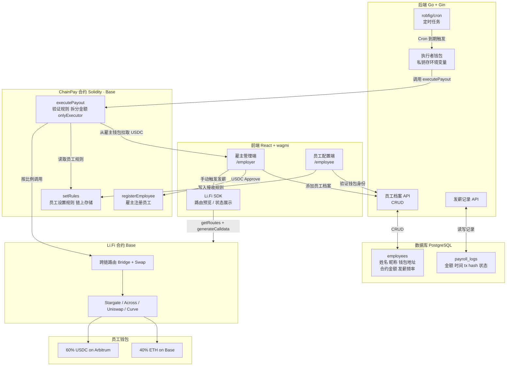

# ChainPay 系统架构图

> 复制下方 Mermaid 代码 → 粘贴到 [mermaid.live](https://mermaid.live) 或导入 Excalidraw

---

## 导入 Excalidraw 步骤

1. 打开 [excalidraw.com](https://excalidraw.com)
2. 点击左上角 `≡` 菜单
3. 选择 **"Import from Mermaid"**
4. 粘贴下方代码，点击 Insert

---

## Mermaid 代码



---

## 文字版架构说明

### 层级划分

| 层级 | 组件 | 职责 |
|---|---|---|
| 前端 | React + wagmi + Li.Fi SDK | 用户交互、钱包连接、路由预览 |
| 链上 | ChainPay 合约（Solidity） | 规则存储、身份验证、发薪执行 |
| 链上 | Li.Fi 合约 | 跨链路由、Bridge、Swap |
| 后端 | Go + Gin + Cron | 档案管理、定时触发、发薪记录 |
| 存储 | PostgreSQL | 链下数据（档案、记录）|

### 核心数据流

```
【员工设置规则】
员工前端 → 调用 ChainPay 合约 setRules → 规则写入链上

【手动发薪】
雇主前端 → Li.Fi SDK 生成 calldata
         → 前端调用合约 executePayout
         → 合约从雇主钱包拉取 USDC
         → 合约调用 Li.Fi 合约
         → Li.Fi 路由到员工多链钱包

【定时发薪】
Go Cron 到期 → 执行者钱包调用合约 executePayout
             → 合约从雇主钱包拉取 USDC
             → 合约调用 Li.Fi 合约
             → Li.Fi 路由到员工多链钱包

【链下存储】
前端 ↔ Go API ↔ PostgreSQL
（员工档案、发薪记录，规则不存数据库）
```
